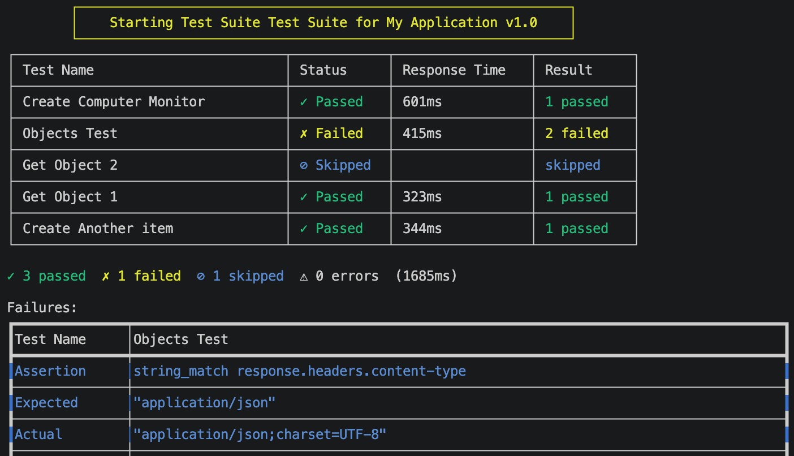

# api-tester-cli

[](https://github.com/snytkine/api-tester-cli/actions/workflows/maven.yml)

[](https://codecov.io/github/snytkine/api-tester-cli)

[](https://snyk.io/test/github/{username}/{repo}?targetFile=package.json)


`api-tester-cli` is a Spring Boot + Spring Shell command-line tool for running HTTP API test suites defined in YAML. Test suites can use Thymeleaf expressions to inject command-line values, values from a local `.env` file, suite-level variables, and per-test variables into requests and assertions.

The project can run as a regular JVM application or as a GraalVM native binary. The JVM build is easiest for development; the native build starts faster and runs without a JVM at runtime.

**Full documentation:** [https://snytkine.github.io/api-tester-cli/test-suite-configuration/](https://snytkine.github.io/api-tester-cli/test-suite-configuration/)



## What It Does

- Executes HTTP test suites described in YAML
- Supports suite-level `rest_client` defaults such as `base_url`, `connect_timeout`, shared headers, and HTTP Basic Auth
- Supports per-request HTTP Basic Auth with automatic precedence handling
- Applies Thymeleaf templating before execution
- Evaluates a broad set of response assertions, including status, JSON, headers, strings, ranges, arrays, and response time
- Emits JSON results in non-interactive mode
- Can show an interactive terminal UI when running in a compatible TTY
- Can generate a self-contained single-page HTML execution report with `--report` (browser-side JSON formatting via optional inline JS)
- Can write debug logs to files when `CLI_LOG_LEVEL` and `CLI_LOG_DIR` are set

## Build And Run

### Standard JVM build

```bash
./mvnw clean package
java -jar target/api-tester-cli-0.0.1-SNAPSHOT.jar
```

### GraalVM native binary

This path requires a GraalVM JDK with `native-image` installed and available on `PATH`.

```bash
./mvnw -Pnative native:compile
./target/api-tester-cli
```

The native executable starts significantly faster than the JVM jar and does not require a JVM on the target machine.

## Running A Test Suite

The main command is `run-suite` with the alias `rs`.

```bash
# Simplest form — run test-suite.yml in the current directory
java -jar target/api-tester-cli-0.0.1-SNAPSHOT.jar run-suite

# Explicit suite path (JVM jar)
java -jar target/api-tester-cli-0.0.1-SNAPSHOT.jar run-suite \
  --suite ./src/test/resources/test-suite-1.yml \
  api_base_url=https://api.restful-api.dev

# Alias form
java -jar target/api-tester-cli-0.0.1-SNAPSHOT.jar rs \
  --suite ./src/test/resources/test-suite-1.yml \
  api_base_url=https://api.restful-api.dev

# Native binary (no --suite — uses test-suite.yml in current directory)
./target/api-tester-cli run-suite
```

CLI variables are passed as positional `key=value` arguments after all named options. They become available in Thymeleaf expressions as `[[${cli.key}]]`.

Example:

```yaml
variables:
  api_base_url: "[[${cli.api_base_url}]]"
```

Important behavior:

- `--suite` is optional. When omitted, the CLI looks for `test-suite.yml` in the current working directory and uses it automatically. If that file is not found either, the command exits with an error.
- `--tag=smoke` runs only tests tagged `smoke`. Prefix with `!` to invert: `--tag="!slow"` runs all tests except those tagged `slow` (tests with no tags are always included under a negated filter).
- `--ui` forces the interactive terminal UI.
- `--no-ui` disables the UI and writes JSON results to stdout.
- Relative file references inside the suite, such as body files or JSON schema files, are resolved relative to the suite file's directory.
- Positional variables must not be written as `--key=value`; Spring Shell treats `--...` tokens as options instead of suite variables.

## Test Suite YAML Format

The top-level structure looks like this:

```yaml
name: "User API smoke suite"
description: "Basic end-to-end checks for the user endpoints."

rest_client:
  base_url: "[[${cli.base_url != null ? cli.base_url : 'http://localhost:8080'}]]"
  connect_timeout: 30000
  headers:
    Accept: "application/json"

variables:
  auth_token: "[[${env.AUTH_TOKEN}]]"
  request_id: "[[${#strings.randomAlphanumeric(12)}]]"

tests:
  - name: "Get all users"
    description: "Returns a non-empty user list."
    variables:
      users_path: "/users"
    request:
      method: "GET"
      url: "[[${suite.base_url}]][[${test.users_path}]]"
      headers:
        Authorization: "Bearer [[${suite.auth_token}]]"
    assertions:
      - type: "status_code"
        expected: 200
      - type: "array_is_not_empty"
        path: "response.body.json"

  - name: "Create user"
    request:
      method: "POST"
      url: "[[${suite.base_url}]]/users"
      headers:
        Authorization: "Bearer [[${suite.auth_token}]]"
        Content-Type: "application/json"
      body:
        type: "inline"
        content: |
          {
            "name": "Alice"
          }
    assertions:
      - type: "status_code"
        expected: 201
      - type: "not_null"
        path: "response.body.json.id"
      - type: "response_time"
        max_ms: 1000
```

### Top-level keys

- `name`: required suite name
- `description`: optional suite description
- `rest_client`: optional suite-wide HTTP client defaults
- `variables`: optional suite-level variables
- `tests`: required list of test cases

### `rest_client`

`rest_client` supports:

- `base_url`: prepended to relative request URLs
- `connect_timeout`: timeout in milliseconds; defaults to `30000`
- `headers`: default headers added to every request in the suite
- `auth`: optional HTTP Basic Auth (suite-level default)

Per-test headers override same-named suite-level headers. Per-test authentication and explicit `Authorization` headers in request headers override suite-level authentication.

#### HTTP Basic Auth

Declare suite-level authentication with `auth`:

```yaml
rest_client:
  base_url: "https://api.example.com"
  auth:
    type: "basic"
    username: "[[${env.API_USER}]]"
    password: "[[${env.API_PASSWORD}]]"
```

Or override with per-request authentication:

```yaml
tests:
  - name: "Admin task"
    request:
      method: "GET"
      url: "/admin/users"
      auth:
        type: "basic"
        username: "[[${env.ADMIN_USER}]]"
        password: "[[${env.ADMIN_PASSWORD}]]"
    assertions:
      - type: "status_code"
        expected: 200
```

**Best Practice:** Store usernames and passwords in a `.env` file or environment variables, then reference them via `[[${env.API_USER}]]` and `[[${env.API_PASSWORD}]]` (never hardcode credentials in the YAML).

Precedence (lowest to highest):
1. Suite-level `rest_client.auth` (applied as default to all requests)
2. Per-request `request.auth` (overrides suite-level)
3. Explicit `Authorization` header in `request.headers` (always wins)

### Test cases

Each item in `tests` supports:

- `name`: required test name
- `description`: optional explanation
- `skip`: optional skip reason; when non-blank, the test is skipped
- `variables`: per-test variables exposed as `test.<name>`
- `request`: required HTTP request definition
- `assertions`: ordered list of assertions

### Request bodies

Requests with methods such as `POST`, `PUT`, `PATCH`, and `DELETE` can include:

```yaml
body:
  type: "inline"
  content: |
    {"name":"Alice"}
```

or:

```yaml
body:
  type: "file"
  content: "request-body.json"
```

## Thymeleaf Variable Namespaces

The CLI currently exposes four variable namespaces during template resolution:

| Namespace | Example | Source |
|---|---|---|
| `cli` | `[[${cli.base_url}]]` | Positional `key=value` arguments after `--suite` |
| `env` | `[[${env.AUTH_TOKEN}]]` | Variables loaded from a `.env` file in the suite directory |
| `suite` | `[[${suite.auth_token}]]` | Values resolved from the suite-level `variables` block |
| `test` | `[[${test.users_path}]]` | Values from the current test case's `variables` block |

The suite is resolved in two passes:

1. `cli` and `env` are used to resolve the top-level `variables` block.
2. The resolved suite variables are then exposed through `suite.*` while the full file is processed again.

That means values like `[[${suite.base_url}]]` are the supported form for suite-level references in request URLs, headers, and assertions.

## The `.env` File

The CLI looks for a `.env` file in the same directory as the suite YAML file and exposes those values through the `env` namespace.

Example:

```dotenv
AUTH_TOKEN=supersecret
BASE_URL=https://api.example.com
```

Example usage inside a suite:

```yaml
variables:
  auth_token: "[[${env.AUTH_TOKEN}]]"
```

This is the right place for secrets or machine-specific configuration that should not be committed into the suite itself.

## Supported Assertions

Every assertion is declared inside a test case's `assertions` list. The `type` field selects the evaluator.

| Type | Purpose | Minimal YAML example |
|---|---|---|
| `status_code` | Exact HTTP status match | `- type: "status_code"\n  expected: 200` |
| `status_in` | HTTP status must match one of several values | `- type: "status_in"\n  expected: [200, 202]` |
| `response_time` | Response duration must stay below a threshold in ms | `- type: "response_time"\n  max_ms: 1000` |
| `json_schema` | Validate JSON against an inline or file-backed schema | `- type: "json_schema"\n  path: "response.body.json"\n  expected:\n    type: "file"\n    content: "schemas/user.json"` |
| `json_match` | Compare JSON against an expected structure, with optional ignored fields | `- type: "json_match"\n  path: "response.body.json"\n  expected:\n    type: "inline"\n    content: '{"status":"ok"}'` |
| `string_match` | String equality check | `- type: "string_match"\n  path: "response.header.content-type"\n  expected: "application/json"` |
| `string_contains` | String contains a substring | `- type: "string_contains"\n  path: "response.body.text"\n  expected: "success"` |
| `regex_match` | String must match a regex pattern | `- type: "regex_match"\n  path: "response.body.text"\n  expected: "^[A-Z0-9_-]+$"` |
| `starts_with` | String prefix check | `- type: "starts_with"\n  path: "response.body.text"\n  expected: "Bearer "` |
| `ends_with` | String suffix check | `- type: "ends_with"\n  path: "response.body.text"\n  expected: ".json"` |
| `not_empty` | Value must exist and not be empty | `- type: "not_empty"\n  path: "response.body.text"` |
| `not_null` | Value must exist and not be null | `- type: "not_null"\n  path: "response.body.json.id"` |
| `is_null` | Value must be null | `- type: "is_null"\n  path: "response.body.json.deletedAt"` |
| `has_header` | Response must contain a named header | `- type: "has_header"\n  name: "x-request-id"` |
| `value_type` | Value must have a given JSON type | `- type: "value_type"\n  path: "response.body.json.id"\n  expected: "number"` |
| `one_of` | Value must equal one item from a list | `- type: "one_of"\n  path: "response.body.json.status"\n  expected: ["pending", "active"]` |
| `assert_true` | Value must resolve to true | `- type: "assert_true"\n  path: "response.body.json.enabled"` |
| `assert_false` | Value must resolve to false | `- type: "assert_false"\n  path: "response.body.json.archived"` |
| `greater_than` | Numeric value must be greater than expected | `- type: "greater_than"\n  path: "response.body.json.total"\n  expected: 0` |
| `greater_than_or_equal` | Numeric value must be at least expected | `- type: "greater_than_or_equal"\n  path: "response.body.json.total"\n  expected: 1` |
| `less_than` | Numeric value must be less than expected | `- type: "less_than"\n  path: "response.body.json.total"\n  expected: 100` |
| `less_than_or_equal` | Numeric value must be at most expected | `- type: "less_than_or_equal"\n  path: "response.body.json.total"\n  expected: 100` |
| `range` | Numeric value must fall within a min/max range | `- type: "range"\n  path: "response.body.json.score"\n  min: 0\n  max: 100` |
| `array_contains` | Array must contain a specific item | `- type: "array_contains"\n  path: "response.body.json.roles"\n  expected: "admin"` |
| `array_contains_all` | Array must contain all listed items | `- type: "array_contains_all"\n  path: "response.body.json.roles"\n  expected: ["read", "write"]` |
| `array_is_empty` | Array must be empty | `- type: "array_is_empty"\n  path: "response.body.json.errors"` |
| `array_is_not_empty` | Array must not be empty | `- type: "array_is_not_empty"\n  path: "response.body.json.items"` |
| `array_size` | Array must have an exact length | `- type: "array_size"\n  path: "response.body.json.items"\n  expected: 3` |
| `array_size_min` | Array length must be at least a minimum | `- type: "array_size_min"\n  path: "response.body.json.items"\n  min: 1` |
| `array_size_max` | Array length must be at most a maximum | `- type: "array_size_max"\n  path: "response.body.json.items"\n  max: 10` |

Common response paths used by assertions include:

- `response.status`
- `response.timeMs`
- `response.body.text`
- `response.body.json`
- `response.body.json.<field>`
- `response.header.<header-name>`

## Exporting The JSON Schema

The CLI bundles a JSON Schema for the test-suite YAML format. Export a local copy with:

```bash
# JVM jar
java -jar target/api-tester-cli-0.0.1-SNAPSHOT.jar export-schema --out ./schemas

# Native binary
./target/api-tester-cli export-schema --out ./schemas

# Using the alias
./target/api-tester-cli es --out ./schemas
```

The `--out` option accepts an absolute or relative path to an **output directory**. The file is
always written as `test-suite-schema.json` inside that directory. The directory is created
automatically if it does not exist. An existing file is overwritten. On success the command prints
the absolute path of the written file:

```
Schema written to: /path/to/schemas/test-suite-schema.json
```

> **Tip:** `es` is a short alias for `export-schema` — both invoke the same command.

### Using the schema for IDE validation

Once you have a local copy of the schema you can wire it to your test-suite YAML files so that your IDE validates the document as you type and provides field-level completions and inline documentation.

The simplest approach — supported by virtually all editors that have
[yaml-language-server](https://github.com/redhat-developer/yaml-language-server) active — is to
add a single comment at the very top of each test-suite YAML file:

```yaml
# yaml-language-server: $schema=./schemas/test-suite-schema.json
```

Use the real path (absolute or relative) to the schema file you exported. No IDE-level
configuration is needed; the language server picks up the directive automatically when the file is
opened.

For IDE-wide mappings that apply without modifying individual files:

- **VS Code** — install the [YAML extension by Red Hat](https://marketplace.visualstudio.com/items?itemName=redhat.vscode-yaml) and add a mapping in `.vscode/settings.json`:
  ```json
  {
    "yaml.schemas": {
      "./schemas/test-suite-schema.json": "**/*-suite*.yml"
    }
  }
  ```
- **IntelliJ IDEA / WebStorm** — go to *Preferences → Languages & Frameworks → Schemas and DTDs → JSON Schema Mappings* and add the exported file mapped to your YAML glob pattern.
- **Other editors** — most editors that support the [Language Server Protocol](https://microsoft.github.io/language-server-protocol/) can be configured with [yaml-language-server](https://github.com/redhat-developer/yaml-language-server); consult your editor's documentation.

> **Note:** Some IDEs require a third-party YAML plugin to enable schema-based validation and autocompletion. If hints do not appear after wiring the schema, check whether a YAML or JSON Schema plugin is installed and enabled.

For a full walkthrough see [Schema Support](https://snytkine.github.io/api-tester-cli/schema-support/).

## Checking The Version

Print the application version with the `version` command:

```bash
# JVM jar
java -jar target/api-tester-cli-0.0.1-SNAPSHOT.jar version

# Native binary
./target/api-tester-cli version
```

Output:

```
Api Tester CLI version 0.2.1
```

The version is embedded at build time from `pom.xml`, so it is accurate for both the JVM jar and
the GraalVM native binary. The same version appears in the footer of generated HTML reports.

## Generating an HTML Report

Add `--report=<directory>` to any `run-suite` invocation to write a self-contained HTML report
after the run completes. Pass the **absolute path to a directory**; the file name is generated
automatically.

```bash
java -jar target/api-tester-cli-0.0.1-SNAPSHOT.jar run-suite \
  --suite ./src/test/resources/test-suite-1.yml \
  --report /tmp/reports \
  api_base_url=https://api.restful-api.dev
```

The CLI prints the exact path once the file is written:

```
Report written to /tmp/reports/test-suite_Test_Suite_1_20260606142300.html
```

### Filename format

```
test-suite_<suiteName>_<yyyyMMddHHmmss>.html
```

`<suiteName>` is the `name` field from your YAML with all non-alphanumeric characters replaced
by underscores.

### What the report contains

- **Header** — suite name, optional description, and generation timestamp
- **Summary cards** — passed / failed / skipped / error / total counts
- **Per-test cards** — one card per test case, showing:
  - Result badge and assertion pass/fail counts
  - Expandable **Request** section (method, URL, headers, body)
  - Expandable **Response** section (status code, response time, headers, pretty-printed body)
  - Expandable **Failed Assertions** section (description, expected vs actual, error message)

The report is fully self-contained (all CSS embedded, no CDN dependencies) and opens in any
browser without an internet connection. By default a small inline JavaScript formatter is
included to pretty-print JSON bodies in the browser; set `REPORT_NO_JS=true` to disable it.
Set `REPORT_NO_MINIFY=true` to skip HTML minification. Both flags can be set in the OS
environment or in the suite's `.env` file.

For full documentation, including a behaviour matrix for these options, see
[HTML Execution Report](https://snytkine.github.io/api-tester-cli/html-report/).

## Debug Logging

File-based logging is controlled by environment variables rather than a command-line flag.

Set both variables before launching the CLI:

- `CLI_LOG_LEVEL`: one of `TRACE`, `DEBUG`, `INFO`, `WARN`, `ERROR`
- `CLI_LOG_DIR`: directory where log files should be written

Example:

```bash
CLI_LOG_LEVEL=DEBUG CLI_LOG_DIR=./logs \
  java -jar target/api-tester-cli-0.0.1-SNAPSHOT.jar run-suite \
  --suite ./src/test/resources/test-suite-1.yml
```

When either variable is missing or invalid, the CLI runs normally without creating a log file.

For more detail, see [DEBUG_LOGGING_README.md](./DEBUG_LOGGING_README.md).

## Development Notes

- Spring Boot version: `4.0.6`
- Spring Shell version: `4.0.2`
- Java version: `25`
- Build tool: Maven Wrapper via `./mvnw`

Useful repository files:

- [HELP.md](./HELP.md)
- [DEBUG_LOGGING_README.md](./DEBUG_LOGGING_README.md)
- [native-build-support.md](./native-build-support.md)
- [src/main/resources/test-suite.yml](./src/main/resources/test-suite.yml)

## Validation

Before opening a PR:

```bash
./mvnw test
```
